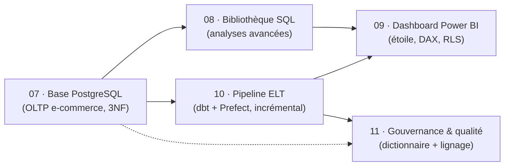

# Bonjour, je suis Valentin Ratigniet 👋

**Analyste / ingénieur données.** Je construis un portfolio qui n'est pas une
collection de projets isolés, mais **un écosystème connecté** : chaque brique
réutilise la précédente — d'une base opérationnelle jusqu'à un pipeline automatisé,
documenté et gouverné.

## 🧭 L'écosystème

La **base du Projet 07** est la source commune : le 08 l'interroge, le 09 la
restitue, le 10 l'automatise, le 11 la documente et la contrôle.

## 📂 Projets

| N° | Projet | Ce qu'il démontre | Stack |
|----|--------|-------------------|-------|
| 01 | [Analyse ventes e-commerce (Olist)](https://github.com/valentinratigniet-byte/projet-01-analyse-ventes-ecommerce) | Étude métier sur données réelles : nettoyage, SQL, insights actionnables | SQL · storytelling |
| 07 | [Base de données e-commerce](https://github.com/valentinratigniet-byte/projet-07-base-ecommerce) | Modélisation 3NF, contraintes, index (`EXPLAIN` ~26× plus rapide) | PostgreSQL · Docker · Faker |
| 08 | [Bibliothèque SQL analytique](https://github.com/valentinratigniet-byte/projet-08-sql-analytique) | 16 requêtes métier : fenêtres, cohortes, RFM, CTE récursive | PostgreSQL · SQL avancé |
| 09 | [Dashboard exécutif Power BI](https://github.com/valentinratigniet-byte/projet-09-dashboard-powerbi) | Modèle en étoile, 17 mesures DAX (YoY/YTD/MoM), RLS | Power BI · DAX · Power Query |
| 10 | [Pipeline ELT automatisé](https://github.com/valentinratigniet-byte/projet-10-pipeline-elt) | ELT medallion, chargement incrémental, 28 tests dbt, orchestration | dbt · Prefect · Python |
| 11 | [Gouvernance & qualité](https://github.com/valentinratigniet-byte/projet-11-gouvernance) | Dictionnaire, conventions, 28 tests qualité, lignage, ownership/SLA | dbt · gouvernance |

## 🛠️ Stack

**Bases & SQL** PostgreSQL · modélisation 3NF & étoile · SQL analytique
**Transformation & pipeline** dbt · Python · chargement incrémental · Prefect
**Restitution** Power BI · DAX · Power Query · RLS
**Outillage** Docker · Git/GitHub

## 🔗 Comment lire ce portfolio

Chaque dépôt suit la même structure : un **README** (problème métier → méthode →
résultats chiffrés → comment rejouer), un dossier `docs/`, et du code versionné.
Commence par le [Projet 07](https://github.com/valentinratigniet-byte/projet-07-base-ecommerce),
la fondation dont tout le reste découle.

<!-- Identité visuelle commune « Petrol & Ambre » appliquée aux dashboards et documents. -->
