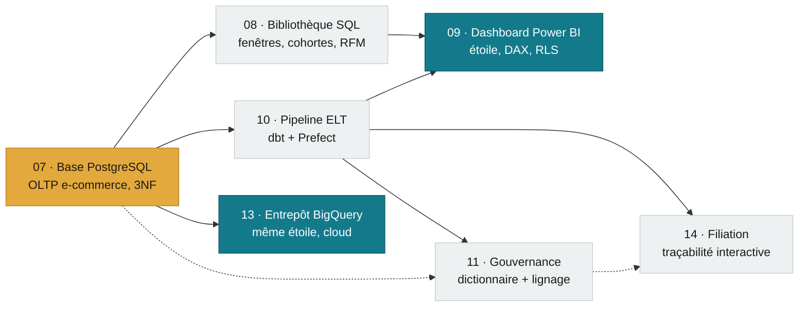
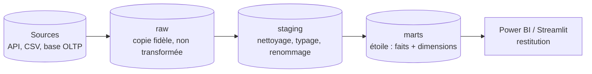

# Bonjour, je suis Valentin Ratigniet 👋

**Profil hybride** : culture financière (Master Économie Appliquée + alternance
Business Analyst) et ingénierie de données. Ce profil n'est pas une collection
de projets isolés — c'est **un écosystème connecté** où chaque brique
réutilise la précédente, de la base opérationnelle jusqu'au cloud.

---

## 🧭 Par où commencer ?

| Tu as... | Regarde... |
|---|---|
| **2 minutes** | Le diagramme juste en dessous — il raconte tout le portfolio en un coup d'œil |
| **15 minutes** | [Projet 07](https://github.com/valentinratigniet-byte/projet-07-base-ecommerce) (la fondation) → [Projet 10](https://github.com/valentinratigniet-byte/projet-10-pipeline-elt) (le pipeline qui l'automatise) → [Projet 05](https://github.com/valentinratigniet-byte/projet-05-assistant-analyse-financiere-rag) (la pièce maîtresse IA) |
| **Envie de "sentir" comment tout s'articule** | [Projet 14](https://github.com/valentinratigniet-byte/projet-14-filiation) — clique sur n'importe quel indicateur et remonte, niveau par niveau, jusqu'à la donnée brute |
| **Vue par compétence** | Le tableau [Projets ci-dessous](#-projets--classés-par-compétence-dominante), classé Data Analyst / Data Engineer / IA-LLM |

## 🧩 L'écosystème

Un seul socle (la base du **Projet 07**, en ambre ci-dessous) irrigue tout le
reste. Chaque flèche est une vraie dépendance technique — pas juste un ordre
de lecture.

**Le même schéma dimensionnel tourne deux fois** : une fois en local
(Power BI ↔ PostgreSQL, Projet 09) et une fois dans le cloud
(Power BI ↔ BigQuery, Projet 13) — la modélisation ne dépend pas de
l'infrastructure qui la porte.

<b>📐 Le motif qui revient dans presque tous les projets : l'architecture "medallion"</b>

 

Chaque couche a un seul rôle : `raw` garde une copie fidèle de la source
(traçabilité, on peut toujours rejouer) ; `staging` nettoie et type sans
changer le sens métier ; `marts` expose un modèle prêt pour l'analyse.
Séparer ces couches évite qu'une transformation cassée corrompe la donnée
source — utilisé dans les projets 04, 10, 11 et 13.

---

## 📚 Concepts clés, expliqués simplement

<b>Qu'est-ce qu'un schéma en étoile ?</b>

 
Une table de <b>faits</b> (les événements mesurables — ex. une vente) entourée
de tables de <b>dimensions</b> (le contexte — client, produit, date). On
dénormalise volontairement pour que les outils BI calculent vite et que le
modèle se comprenne sans formation. Utilisé dans les projets 04, 09 et 13.

<b>ETL vs ELT — quelle différence ?</b>

 
ETL transforme les données <i>avant</i> de les charger. ELT charge d'abord la
donnée brute, puis transforme <i>dans</i> l'entrepôt (avec dbt, par exemple) —
plus flexible : on garde toujours la source pour rejouer une transformation
différente sans tout ré-extraire. C'est l'approche des projets 04, 10 et 13.

<b>Pourquoi tester ses données comme du code ?</b>

 
Un test dbt (unicité, non-nullité, intégrité référentielle) casse le pipeline
si une hypothèse sur la donnée n'est plus vraie — plutôt que de laisser un
dashboard afficher un chiffre faux en silence. Sur ce portfolio :
<b>28 tests</b> (Projet 10), <b>28 tests</b> (Projet 11), <b>12/12 tests</b>
(Projet 13).

<b>RAG, en une phrase</b>

 
<i>Retrieval-Augmented Generation</i> : avant de répondre, le modèle cherche
les passages pertinents dans les documents (recherche vectorielle), puis
génère sa réponse <i>uniquement</i> à partir de ces extraits, avec citations
et un refus explicite si l'info n'y est pas. Ça réduit drastiquement les
hallucinations — Projet 05, rappel de récupération mesuré à 100 %.

<b>Le principe du moindre privilège (IAM)</b>

 
Un compte de service ne reçoit que les droits strictement nécessaires à sa
tâche — jamais un rôle "Owner" par défaut. Sur le Projet 13, le compte
<code>dbt-loader</code> n'a que <code>bigquery.dataEditor</code> +
<code>bigquery.jobUser</code>, aucun accès au reste du projet cloud.

---

## 📂 Projets — classés par compétence dominante

### 📊 Data Analyst — de la donnée brute à la décision

<b>01 · Analyse des ventes e-commerce (Olist)</b> — données réelles Kaggle, ~100k commandes

 

**Problème** : une baisse de CA constatée — est-ce la qualité de service qui
s'est dégradée, ou autre chose ?
**Méthode** : nettoyage SQL, 7 requêtes KPI, dashboard Power BI (étoile,
15 mesures).
**Résultat** : la baisse n'est pas liée à la qualité (délais raccourcis
pendant la baisse) — le vrai problème est la rétention : **97 % des clients
ne commandent qu'une fois**.

 
· [Repo](https://github.com/valentinratigniet-byte/projet-01-analyse-ventes-ecommerce)

<b>02 · Nettoyage & qualité de données (NYC 311)</b> — 50k lignes, API réelle

 

**Problème** : des données d'incidents municipaux avec des villes mal
saisies, des catégories manquantes, des dates aberrantes.
**Méthode** : module Pandas réutilisable + vue SQL, 8 règles de qualité
testées.
**Résultat** : **8/8 tests PASS** — villes non standardisées 46 280 → 0,
catégories manquantes 54 → 0.

 
· [Repo](https://github.com/valentinratigniet-byte/projet-02-pipeline-nettoyage-qualite)

<b>03 · Suivi de prix de jeux vidéo + web app</b> — déployée en ligne

 

**Problème** : repérer les meilleures affaires jeux vidéo sans dataset propre
existant.
**Méthode** : collecte API CheapShark (choix éthique vs scraping fragile) →
SQLite, app Flask avec filtres réactifs et graphique Chart.js.
**Résultat** : app **déployée sur Render**, rafraîchissement automatique
quotidien des prix via GitHub Actions.

 
· [Repo](https://github.com/valentinratigniet-byte/projet-03-scraper-prix-jeux-dashboard) · [Démo live](https://projet-03-scraper-prix-jeux-dashboard.onrender.com)

<b>06 · Automatisation de reporting Excel</b> — gain de temps chiffré

 

**Problème** : un rapport Excel mensuel refait à la main à chaque fois.
**Méthode** : génération programmatique (openpyxl) — mise en forme, 4
feuilles, graphiques natifs — depuis la base du Projet 07 ; mini-app
Streamlit pour le lancer sans coder.
**Résultat** : **~38 h/an** gagnées, documenté et chiffré.

 
· [Repo](https://github.com/valentinratigniet-byte/projet-06-automatisation-reporting-excel)

<b>08 · Bibliothèque SQL analytique</b> — 16 requêtes métier commentées

 

**Problème** : démontrer une maîtrise SQL au-delà du `SELECT` simple.
**Méthode** : fonctions fenêtres, cohortes de rétention, segmentation RFM,
CTE récursive — chaque requête commentée avec sa logique métier.
**Résultat** : bibliothèque réutilisable, note d'optimisation des
performances incluse.

· [Repo](https://github.com/valentinratigniet-byte/projet-08-sql-analytique)

<b>09 · Dashboard exécutif Power BI</b> — modèle en étoile complet

 

**Problème** : donner une vue fiable et unique de la performance commerciale.
**Méthode** : modèle en étoile propre, 17 mesures DAX (time intelligence
YoY/YTD/MoM), sécurité au niveau des lignes (RLS).
**Résultat** : dashboard 2 pages, drill-down, documentation in-situ du
modèle.

 
· [Repo](https://github.com/valentinratigniet-byte/projet-09-dashboard-powerbi)

### 🏗️ Data Engineer — pipelines & infrastructure

<b>07 · Base de données e-commerce (PostgreSQL)</b> — la fondation du portfolio

 

**Problème** : construire un socle opérationnel réutilisable par tous les
autres projets.
**Méthode** : modélisation relationnelle 3NF, contraintes d'intégrité, index
ciblés, conteneurisé Docker.
**Résultat** : requêtes **~26× plus rapides** (`EXPLAIN ANALYZE` avant/après),
base réutilisée par 6 autres projets du portfolio.

 
· [Repo](https://github.com/valentinratigniet-byte/projet-07-base-ecommerce)

<b>04 · Entrepôt de données multi-sources</b> — DuckDB local

 

**Problème** : croiser 3 sources hétérogènes (base transactionnelle, calendrier,
météo) sans infra cloud.
**Méthode** : entrepôt **DuckDB** + dbt-duckdb, orchestration Prefect en une
commande.
**Résultat** : 10 modèles dbt, **11 tests PASS**, `dim_date` fusionne
calendrier et météo.

 
· [Repo](https://github.com/valentinratigniet-byte/projet-04-entrepot-donnees-etl)

<b>10 · Pipeline ELT automatisé</b> — architecture medallion

 

**Problème** : automatiser la chaîne complète source → entrepôt sans
tout recharger à chaque fois.
**Méthode** : extraction incrémentale par watermark (public → raw), dbt
(staging → marts en étoile), orchestration Prefect.
**Résultat** : **28 tests dbt PASS**, validé sur données réelles (+928 lignes
incrémentales, 0 doublon au 2ᵉ passage).

 
· [Repo](https://github.com/valentinratigniet-byte/projet-10-pipeline-elt)

<b>11 · Gouvernance & qualité des données</b> — dictionnaire + lignage

 

**Problème** : sans gouvernance, personne ne sait ce que signifie une colonne
ni qui est responsable d'une table.
**Méthode** : dictionnaire raw/staging/marts, conventions de nommage, tests
dbt, lignage généré automatiquement.
**Résultat** : **28 tests qualité PASS**, ownership et SLA documentés par
table.

 
· [Repo](https://github.com/valentinratigniet-byte/projet-11-gouvernance)

⭐ <b>14 · Filiation</b> — documentation vivante et interactive de traçabilité

 

**Problème** : le lignage dbt (Projet 11) est exact mais lu par des
data engineers — pas par quelqu'un qui demande juste "d'où vient ce chiffre ?".
**Méthode** : page cliquable qui remonte un indicateur/colonne/table jusqu'à
sa donnée brute ; jeu de données réel introspecté depuis le Projet 10
(`manifest.json`/`catalog.json`/`run_results.json`, rien d'inventé), script
Python rejouable après chaque `dbt run`.
**Résultat** : 13 nœuds (5 sources + 8 modèles), **28 tests dbt réels**
affichés avec leur statut, lecture seule + renvoi vers le système source
(gouvernance, pas d'édition directe en base).

 
· [Repo](https://github.com/valentinratigniet-byte/projet-14-filiation)

<b>12 · Dédoublonnage & golden record</b> — entity resolution

 

**Problème** : deux sources clients avec doublons, fautes de frappe et
variantes de noms — aucun identifiant fiable.
**Méthode** : standardisation, fuzzy matching (rapidfuzz), union-find pour
regrouper les doublons, règles de survivorship.
**Résultat** : 1280 → 813 golden records, **précision 97,2 % / rappel
95,9 % / F1 96,5 %** — mesuré contre une vérité terrain connue.

 
· [Repo](https://github.com/valentinratigniet-byte/projet-12-nettoyage-standardisation-dedoublonnage)

⭐ <b>13 · Entrepôt central BigQuery</b> — le même modèle, dans le cloud <i>(déplié — la preuve cloud du portfolio)</i>

 

**Problème** : est-ce que la modélisation dimensionnelle du Projet 09 tient
la route hors d'un environnement local ?
**Méthode** : extraction `dlt` (PostgreSQL → BigQuery `raw`), dbt-bigquery
(`staging` → `marts`, même étoile que le Projet 09), IAM à privilège minimal,
Power BI branché sur `marts`.
**Résultat** : **12/12 tests dbt PASS**, compte de service sans rôle Owner,
modèle documenté in-situ.

  
· [Repo](https://github.com/valentinratigniet-byte/projet-13-entrepot-central-bigquery)

### 🤖 IA / LLM

⭐ <b>05 · Assistant d'analyse financière (RAG/LLM)</b> — la pièce maîtresse IA <i>(déplié — le projet le plus démonstratif)</i>

 

**Problème** : un LLM seul hallucine des chiffres financiers plausibles mais
faux — inacceptable sur ce sujet.
**Méthode** : récupération vectorielle locale (embeddings, sans clé API) +
génération Claude, avec garde-fous (ancrage strict, citations obligatoires,
refus explicite mesuré).
**Résultat** : **rappel de récupération 100 %** (7/7) sur un jeu d'évaluation
à vérité terrain connue, garde-fous documentés et testés.

  
· [Repo](https://github.com/valentinratigniet-byte/projet-05-assistant-analyse-financiere-rag)

---

## ✅ Bonnes pratiques appliquées sur tout le portfolio

| Pratique | Comment elle est appliquée ici |
|---|---|
| **Un repo = un projet** | 14 dépôts indépendants, chacun avec un README structuré (problème → méthode → résultats chiffrés → reproduction) |
| **Tests systématiques, vérifiés par CI** | dbt tests (unicité, non-nullité, intégrité référentielle) sur les projets 04/10/11/13 ; tests qualité Python sur les projets 02/12/14 ; 9 des 14 dépôts ont une CI GitHub Actions qui rejoue le pipeline à chaque push — badge cliquable dans chaque README concerné, pas juste une affirmation |
| **Documentation vivante** | Journal de bord par projet, descriptions **in-situ** dans les modèles Power BI, dictionnaires de données générés (pas de doc qui se périme dans un coin) |
| **Secrets jamais commités** | `.gitignore` systématique, clés de service hors repo, tout secret lu depuis l'environnement (`ANTHROPIC_API_KEY`, `GOOGLE_APPLICATION_CREDENTIALS`) |
| **Moindre privilège** | Comptes de service à droits scopés (IAM BigQuery : `dataEditor` + `jobUser`, jamais `Owner`) |
| **Reproductibilité** | Scripts rejouables (`load_postgres_to_bq.py`, `fetch_deals.py`, `build_index()`), environnements Docker/venv versionnés |
| **Garde-fous coûts cloud** | Région unique, colonnes explicites (jamais de `SELECT *`), staging en vues / marts en tables matérialisées |
| **Commits descriptifs** | Convention `feat:` / `docs:` / `fix:`, message = contexte + résultat chiffré, jamais juste "update" |

---

## 📊 Activité GitHub

---

## 🔗 Une structure commune, projet après projet

Chaque dépôt suit le même plan — **problème métier → méthode → résultats
chiffrés → comment rejouer** — un dossier `docs/`, du code versionné, et une
CI qui vérifie ce qu'il avance plutôt que de se contenter de l'affirmer.
Retrouve le point de départ recommandé plus haut, dans
[« Par où commencer »](#-par-où-commencer-).

## 🎨 Identité visuelle

Charte commune **« Petrol & Ambre »** appliquée à tous les dashboards et
documents du portfolio : <code>#137A8B</code> (signature), <code>#E4A93C</code>
(accent), déclinée en thème Power BI réutilisable — un détail qui compte
autant que le code pour donner une impression de cohérence sur 14 projets.

*Merci d'être passé·e voir. Discutons-en →*

